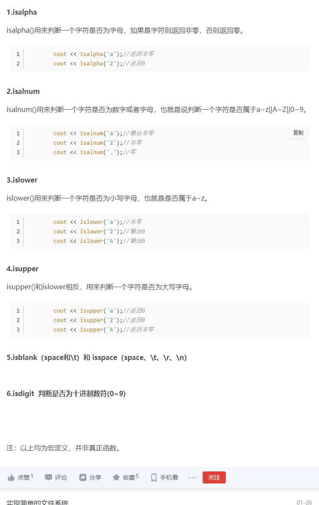
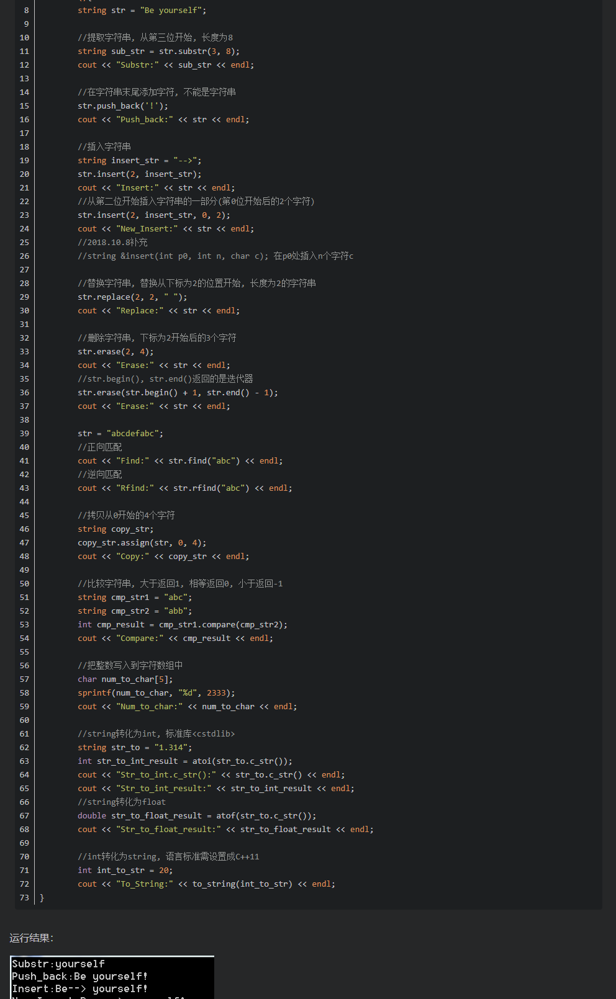

#### 未解释的语言都指代c++语法

##### 1.s.reverse()---python；reverse(front,back)-------c++					

>  用于反向列表中元素。
>
>  front为要反转位置的首地址，back为要反转位置的末尾地址+1
>
>  例：
>
>  ```c++
>  string s = "abcdefg";
>  
>  reverse(s.begin(),s.begin()+2);//=====>"bacdefg"
>  ```

##### 2.s.size()							

> 获取列表元素个数（也可以获取字符串的长度）

##### 3.swap(i,j)						

> 交换 i，j 的值

##### 4.string.find(ch)				

> string为字符串，ch为字符，查看目标字符是否在该字符串中，若不在则返回-1

##### 5.sort(v.begin(),v.end())-------c++,							

> 从小到大排序

##### 6.list.sort( key=None, reverse=False)--------python

> - key -- 主要是用来进行比较的元素，只有一个参数，具体的函数的参数就是取自于可迭代对象中，指定可迭代对象中的一个元素来进行排序。
> - reverse -- 排序规则，**reverse = True** 降序， **reverse = False** 升序（默认）。

##### 7.for(char ch: s)

> s:字符串
>
> 获取字符串中每一个字符进行循环

##### 8.isalpha(char)

> 判断一个字符是否为字母，如果是字符则返回非零，否则返回零
>
> ```c++
> cout << isalpha('a');//输出非零
> cout << isalpha('2');//返回0
> ```



##### 9.queue<TreeNode*> Q

> 定义队列（stl）

##### 10.Q.push(root)

> 入队

##### 11.Q.pop()

> 出队

##### 12.TreeNode* node = Q.front()

> 提取队列第一个元素

##### 13.字符串常用函数



##### 14.stl中的数据结构是可以直接赋值给另一个变量的 （**注意**：数组是不能直接赋值的）

##### 15.**sizeof**(values)/**sizeof**(values[0])

> 获取数组的长度（values为数组）
>
> stl中的数据结构可以直接使用s.size()函数获取元素个数

##### 16.map初始化的多种方法

> (1).直接赋值
>
> ```c++
> map<string, int> m1;
> m1["def"] = 2;
> ```
>
> (2).用insert添加
>
> ```c++
>     map<string, int> m2;
>     m2.insert({ "abc", 1 });    //使用这种就可以了
>     //其他形式和方式
>     m2.insert(make_pair(string("def"), 2));
>     m2.insert(pair<string, int>(string("ghi"), 3));
> ```
>
> (3).列表初始化
>
> ```c++
>     map<string,int> m3 = {
>     {"string",1}, {"sec",2}, {"trd",3}
>     };
>  
>     map<string,string> m4 = {
>     {"first","second"}, {"third","fourth"},
>     {"fifth","sixth"}, {"begin","end"}
>     };
> ```
>
> (4).不指定值
>
> ```c++
> string<string,string> m5 = {
>     {"first",""}, {"second",""}
>     {"third",""}, {"fourth",""}
> };
> ```

##### 17.java中如果需要对字符串进行连接，尽量采用StringBuilder类而不采用 ’ + ‘   前者消耗的时间更加少而且更加灵活

> 参考链接：[java中StringBuilder使用方法](https://www.cnblogs.com/onetheway2018/p/11553168.html)

##### 18.s.charAt(i)------------java

> 获取字符串的目标字符
>
> java中要获取字符串的某个字符不能直接使用下标来获取 如： s[i] 而是使用s.charAt(i)
>
> c++中的String其实也是不能直接获取的 但是string是可以直接获取的 这是一个stl容器

##### 19.vector初始化方法

> (1)不带参数的构造函数初始化
>
> ```c++
> vector<int> abc;// 初始化一个size为0的vector
> ```
>
> (2)带参数的构造函数初始化
>
> ```c++
> // 初始化size，但每个元素值为默认值
> vector<int> abc(10);  // 初始化了10个默认值为0的元素
> // 初始化size，并且设置初始值
> vector<int> cde(10, 1);  // 初始化了10个值为1的元素
> ```
>
> (3)通过数组地址初始化
>
> ```c++
> int a[5] = {1,2,3,4,5};// 通过数组a的地址初始化，注意地址是从0到5（左闭右开）
> ```
>
> (4)通过同类型vector初始化
>
> ```c++
> vector<int> a(5, 1);
> // 通过a初始化
> vector<int> b(a);
> ```

##### 20.在输出的时候注意print中的引号是双引号而不是单引号

##### 21.如果在计算中害怕超出界限可以将一个大数拆分成为小数进行计算

##### 21.C++声明数组是大括号

```c++
int lun[12]={31,28,31,30,31,30,31,31,30,31,30,31};
```

##### 22.快速约分

```c++
//辗转相减法是一种简便的求出两数最大公约数的方法。（更相减损术）辗转相减法（求最大公约数），即尼考曼彻斯法，其特色是做一系列减法，从而求得最大公约数。例如 ：两个自然数35和14，用大数减去小数，(35,14)->(21,14)->(7,14)，此时，7小于14，要做一次交换，把14作为被减数，即(14,7)->(7,7)，再做一次相减，结果为0，这样也就求出了最大公约数7
long long gcd(long long a,long long b)
{
	int aa=a,bb=b;
	while(aa!=bb)
	{
		if(aa>bb)
		{
			aa=aa-bb;
		}
		else 
		{
			bb=bb-aa;
		}
	}
	return a/aa;
}
```

##### 23.对于传统数组采用快排

> ```c++
> int a[10];
> sort(a,a+a.size());
> ```
>

##### 24、测试branch功能