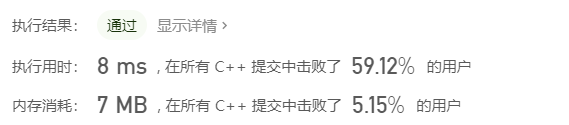

#### 299.猜数字游戏

###### 题目：

> 你在和朋友一起玩 猜数字（Bulls and Cows）游戏，该游戏规则如下：
>
> 1.你写出一个秘密数字，并请朋友猜这个数字是多少。
> 2.朋友每猜测一次，你就会给他一个提示，告诉他的猜测数字中有多少位属于数字和确切位置都猜对了（称为“Bulls”, 公牛），有多少位属于数字猜对了但是位置不对（称为“Cows”, 奶牛）。
> 3.朋友根据提示继续猜，直到猜出秘密数字。
> 请写出一个根据秘密数字和朋友的猜测数返回提示的函数，返回字符串的格式为 xAyB ，x 和 y 都是数字，A 表示公牛，用 B 表示奶牛。
>
> * xA 表示有 x 位数字出现在秘密数字中，且位置都与秘密数字一致。
>
> * yB 表示有 y 位数字出现在秘密数字中，但位置与秘密数字不一致。
>
> 请注意秘密数字和朋友的猜测数都可能含有重复数字，每位数字只能统计一次。

###### 示例：

> 输入: secret = "1807", guess = "7810"
> 输出: "1A3B"
> 解释: 1 公牛和 3 奶牛。公牛是 8，奶牛是 0, 1 和 7。
>
> 
>
> 输入: secret = "1123", guess = "0111"
> 输出: "1A1B"
> 解释: 朋友猜测数中的第一个 1 是公牛，第二个或第三个 1 可被视为奶牛。

###### 标签：

> 哈希表  字符串

###### 思路：

>  1.求公牛
>
>  for循环：遍历两个字符串，如果相同的下标的元素也相同则公牛加一，循环完成求得公牛
>
>  2.求母牛
>
>  对于两个字符串都构建map映射 键：字符 ；值：字符出现的次数 
>
>  map1 map2同字符对应的值的较小方的和 - 公牛 = 母牛

###### 编码：

```c++
class Solution {
public:
    string getHint(string secret, string guess) {
        int n=secret.size();
        int a=0,b=0;
        unordered_map <char,int> am,bm;
        for(int i=0;i<n;i++){
            if(secret[i]==guess[i])
                a++;
            am[secret[i]]++;
            bm[guess[i]]++;
        }
        for(int i=0;i<10;i++){
            b+=min(am[i+'0'],bm[i+'0']);
        }
        b-=a;
        return to_string(a)+"A"+to_string(b)+"B";
    }
};
```

###### 结果：

