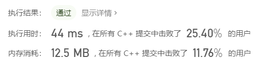

#### 506.相对名次

###### 题目：

> 给出 N 名运动员的成绩，找出他们的相对名次并授予前三名对应的奖牌。前三名运动员将会被分别授予 “金牌”，“银牌” 和“ 铜牌”（"Gold Medal", "Silver Medal", "Bronze Medal"）。
>
> (注：分数越高的选手，排名越靠前。)
>

###### 示例：

> 输入: [5, 4, 3, 2, 1]
> 输出: ["Gold Medal", "Silver Medal", "Bronze Medal", "4", "5"]
> 解释: 前三名运动员的成绩为前三高的，因此将会分别被授予 “金牌”，“银牌”和“铜牌” ("Gold Medal", "Silver Medal" and "Bronze Medal").
> 余下的两名运动员，我们只需要通过他们的成绩计算将其相对名次即可。
>
> 
>
> **提示:**
>
> 1. N 是一个正整数并且不会超过 10000。
> 2. 所有运动员的成绩都不相同。

###### 标签：

> 哈希表  字符串

###### 思路：

>  1.求公牛
>
>  for循环：遍历两个字符串，如果相同的下标的元素也相同则公牛加一，循环完成求得公牛
>
>  2.求母牛
>
>  对于两个字符串都构建map映射 键：字符 ；值：字符出现的次数 
>
>  map1 map2同字符对应的值的较小方的和 - 公牛 = 母牛

###### 编码：

```c++
//先排序 利用哈希表存储对应位次
class Solution {
public:
    vector<string> findRelativeRanks(vector<int>& nums) {
        int n=nums.size();
        vector<int> temp=nums;
        sort(temp.begin(),temp.end());
        map<int,int> m;
        for(int i=0;i<n;i++){
            m[temp[i]]=i;
        }
        vector<string> res;
        for(int i=0;i<n;i++){
            if(m[nums[i]]==n-1){
                res.push_back("Gold Medal");
            }
            else if(m[nums[i]]==n-2){
                res.push_back("Silver Medal");
            }
            else if(m[nums[i]]==n-3){
                res.push_back("Bronze Medal");
            }
            else {
                res.push_back(to_string(n-m[nums[i]]));
            }
        }
        return res;
    }
};
```

```c++
//超出时间限制
class Solution {
public:
	vector<string> findRelativeRanks(vector<int>& nums) {
		vector<string> ans;//存储结果
		unordered_map<int, int> m;
		int n = nums.size();
		for (int i = 0; i < n; i++) {
			m[nums[i]] = 1;
			for (int j = 0; j < i; j++) {
				if (nums[j] < nums[i]) {
					m[nums[j]] += 1;
				}
				else {
					m[nums[i]] = max(m[nums[i]], m[nums[j]] + 1);
				}
			}
		}
		for (int i = 0; i < n; i++) {
			if (m[nums[i]] == 1) {
				ans.push_back("Gold Medal");
			}
			else if (m[nums[i]] == 2) {
				ans.push_back("Silver Medal");
			}
			else if (m[nums[i]] == 3) {
				ans.push_back("Bronze Medal");
			}
			else {
				ans.push_back(to_string(m[nums[i]]));
			}
		}
		return ans;
	}
};
```


###### 结果：

