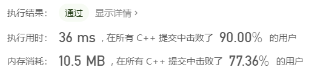

#### 696.计数二进制子串

###### 题目：

> 给定一个字符串 s，计算具有相同数量0和1的非空(连续)子字符串的数量，并且这些子字符串中的所有0和所有1都是组合在一起的。
>
> 重复出现的子串要计算它们出现的次数。
>

###### 示例：

> 输入: "00110011"
> 输出: 6
> 解释: 有6个子串具有相同数量的连续1和0：“0011”，“01”，“1100”，“10”，“0011” 和 “01”。
>
> 请注意，一些重复出现的子串要计算它们出现的次数。
>
> 另外，“00110011”不是有效的子串，因为所有的0（和1）没有组合在一起。
>
> 
>
> 输入: "10101"
> 输出: 4
> 解释: 有4个子串：“10”，“01”，“10”，“01”，它们具有相同数量的连续1和0
>
> 
>
> **注意**
>
> 1. `s.length` 在1到50,000之间。
> 2. `s` 只包含“0”或“1”字符

###### 标签：

> 字符串

###### 思路：

>  我们首先记录有几个连续相同的元素 n 
>
>  然后观察后面 n 个元素有多少个对应的连续元素 将连续的个数加到sum上
>
>  接着处理后面的元素即可

###### 编码：

```c++
class Solution {
public:
	int countBinarySubstrings(string s) {
		int sum = 0;
		int target = 0;
		int temp = 0;
		int n = s.size();
		while (target < n) {
			char mark = s[target];
			int count = 0;
			int negative = 1;
			while (s[target] == mark) {
				target++;
				count++;//记录有几个连续相同的元素
			}
			if (mark == '0') {
				negative = 0;
			}
			for (int i = target; i < target + count; i++) {
				if (s[i] == '1' - negative) {
					sum++;
				}
				else {
					break;
				}
			}
		}
		return sum;
	}
};
```


###### 结果：



